# PostgreSQL Delta Lake Schema - Entity Relationship Diagram

## Visual Schema

```mermaid
erDiagram
    DL_TABLES ||--o{ DL_TABLE_VERSIONS : "1:N"
    DL_TABLES ||--o{ DL_ADD_FILES : "1:N"
    DL_TABLES ||--o{ DL_REMOVE_FILES : "1:N"
    DL_TABLES ||--o{ DL_METADATA_UPDATES : "1:N"
    DL_TABLES ||--o{ DL_PROTOCOL_UPDATES : "1:N"
    DL_TABLES ||--o{ DL_TXN_ACTIONS : "1:N"
    DL_TABLES ||--o{ DL_MIRROR_STATUS : "1:N"

    DL_TABLES {
        uuid table_id PK "Primary Key"
        string table_name
        text location
        bigint current_version
        int min_reader_version
        int min_writer_version
        jsonb properties
        timestamp created_at
        timestamp updated_at
    }

    DL_TABLE_VERSIONS {
        uuid table_id FK "Foreign Key"
        bigint version PK "Composite PK"
        int operation "0=ADD, 1=REMOVE, 2=METADATA, 3=PROTOCOL, 4=TXN"
        string committer
        timestamp timestamp
        jsonb metadata
        bigint file_count
    }

    DL_ADD_FILES {
        uuid table_id FK "Foreign Key"
        bigint version FK "Composite FK"
        string path PK "Composite PK"
        bigint size
        bigint modification_time
        bigint data_change_version
        jsonb partition_values "GIN indexed"
        jsonb stats "GIN indexed"
        string tags "Comma-separated"
    }

    DL_REMOVE_FILES {
        uuid table_id FK "Foreign Key"
        bigint version FK "Composite FK"
        string path PK "Composite PK"
        bigint deletion_timestamp
        boolean dataChange
        jsonb tags
    }

    DL_METADATA_UPDATES {
        uuid table_id FK "Foreign Key"
        bigint version FK "Composite FK"
        string key PK "Composite PK"
        string value
        timestamp timestamp
    }

    DL_PROTOCOL_UPDATES {
        uuid table_id FK "Foreign Key"
        bigint version FK "Composite FK"
        string protocol PK "Composite PK"
        int min_reader_version
        int min_writer_version
        jsonb features
    }

    DL_TXN_ACTIONS {
        uuid table_id FK "Foreign Key"
        bigint version FK "Composite FK"
        uuid app_id PK "Composite PK"
        bigint version PK "Composite PK"
        string action "0=ADD, 1=REMOVE"
        string file_path
        bigint file_size
        timestamp timestamp
    }

    DL_MIRROR_STATUS {
        uuid table_id FK "Foreign Key"
        string mirror_engine PK "Composite PK"
        bigint mirrored_version
        string last_error
        timestamp last_sync_time
        timestamp updated_at
    }
```



## Table Relationships

### Core Table: `dl_tables`
**Purpose**: Registry of all Delta Lake tables stored in PostgreSQL

- **Primary Key**: `table_id` (UUID)
- **Constraints**: 
  - `table_name` is unique per namespace
  - `current_version >= 0`
  - `min_reader_version > 0`

**Related Tables**:
- All action tables (`dl_add_files`, `dl_remove_files`, etc.) have foreign keys to `table_id`
- One-to-many relationships (one table has many versions and actions)

---

### Version Tracking: `dl_table_versions`
**Purpose**: Maintains immutable commit log per table

- **Primary Key**: `(table_id, version)` - Composite PK ensures one record per table-version
- **Foreign Key**: `table_id` references `dl_tables.table_id`
- **Indexes**:
  - `(table_id DESC, version DESC)` - Fast latest version lookup
  - `(table_id, version)` - Primary key support

**Query Patterns**:
```sql
-- Get latest version: O(1) with index
SELECT version FROM dl_table_versions 
WHERE table_id = $1 
ORDER BY version DESC LIMIT 1;

-- Get version at timestamp: O(log n) with index
SELECT version FROM dl_table_versions 
WHERE table_id = $1 AND timestamp <= $2 
ORDER BY timestamp DESC LIMIT 1;
```

---

### Action Tables: `dl_add_files`, `dl_remove_files`
**Purpose**: Track file additions and removals per version

#### `dl_add_files`
- **Composite PK**: `(table_id, version, path)`
- **Foreign Key**: `(table_id, version)` references `dl_table_versions`
- **Indexes**:
  - `(table_id, path, version)` - File lookup across versions
  - `(table_id, version)` - Version scans
  - GIN index on `partition_values` - Predicate pushdown
  - GIN index on `stats` - Stats queries
- **Partitioned by**: `table_id` for large deployments

**Query Patterns**:
```sql
-- All files in version: O(log n)
SELECT path, size FROM dl_add_files 
WHERE table_id = $1 AND version = $2;

-- File history: O(log n)
SELECT version, size FROM dl_add_files 
WHERE table_id = $1 AND path = $2 
ORDER BY version;

-- Partition filtering: O(1-1000) with GIN index
SELECT path FROM dl_add_files 
WHERE table_id = $1 
  AND version = $2 
  AND partition_values @> '{"year": 2024}';
```

#### `dl_remove_files`
- Same structure as `dl_add_files` for consistency
- **Composite PK**: `(table_id, version, path)`
- Contains deletion metadata (timestamp, dataChange flag)

---

### Metadata Tables: `dl_metadata_updates`, `dl_protocol_updates`
**Purpose**: Track schema and protocol evolution

#### `dl_metadata_updates`
- **Composite PK**: `(table_id, version, key)`
- **Foreign Key**: `(table_id, version)` references `dl_table_versions`
- Stores arbitrary key-value pairs (schema, description, etc.)

#### `dl_protocol_updates`
- **Composite PK**: `(table_id, version, protocol)`
- **Foreign Key**: `(table_id, version)` references `dl_table_versions`
- Tracks min reader/writer versions and features

---

### Streaming: `dl_txn_actions`
**Purpose**: Track streaming progress for transaction logs

- **Composite PK**: `(table_id, app_id, version)`
- **Foreign Key**: `(table_id, version)` references `dl_table_versions`
- `app_id` identifies the streaming application

**Use Cases**:
- Streaming readers tracking their progress
- Exactly-once semantics for file processing

---

### Mirror Integration: `dl_mirror_status`
**Purpose**: Track mirror engine synchronization status

- **Composite PK**: `(table_id, mirror_engine)`
- **Foreign Key**: `table_id` references `dl_tables.table_id`
- `mirror_engine` values: `"spark"`, `"duckdb"`, `"iceberg"`, etc.

**Query Patterns**:
```sql
-- Check sync status for all engines
SELECT mirror_engine, mirrored_version, last_sync_time 
FROM dl_mirror_status 
WHERE table_id = $1;

-- Check for sync errors
SELECT mirror_engine, last_error 
FROM dl_mirror_status 
WHERE table_id = $1 AND last_error IS NOT NULL;
```

---

## Index Strategy

### Performance-Critical Indexes

| Index | Columns | Type | Purpose | Query Pattern |
|-------|---------|------|---------|--------------|
| PK | `(table_id, version)` | BTREE | Version uniqueness | Time travel, snapshots |
| Version ordering | `(table_id DESC, version DESC)` | BTREE | Latest version | O(1) latest lookup |
| File path | `(table_id, path, version)` | BTREE | File tracking | File existence checks |
| Partition values | `partition_values` | GIN | Predicate pushdown | Partition filtering |
| Stats | `stats` | GIN | Stats queries | Optimization |

### Index Maintenance

- **Partitioned indexes** for tables with > 1M rows
- **BRIN indexes** for timestamp columns (low selectivity)
- Indexes automatically maintained by PostgreSQL
- **Partial indexes** for frequently filtered columns

---

## Foreign Key Constraints

All action tables maintain referential integrity:

```sql
ALTER TABLE dl_add_files ADD CONSTRAINT fk_add_files_version
  FOREIGN KEY (table_id, version) 
  REFERENCES dl_table_versions(table_id, version)
  ON DELETE CASCADE ON UPDATE CASCADE;

ALTER TABLE dl_remove_files ADD CONSTRAINT fk_remove_files_version
  FOREIGN KEY (table_id, version) 
  REFERENCES dl_table_versions(table_id, version)
  ON DELETE CASCADE ON UPDATE CASCADE;

-- ... similar for other action tables
```

**Cascade Behavior**: Deleting a version cascades to all related actions

---

## Scalability Considerations

### Partitioning Strategy

For tables with > 100M rows:

```sql
-- Range partition by table_id hash
CREATE TABLE dl_add_files_0 PARTITION OF dl_add_files
  FOR VALUES WITH (modulus 4, remainder 0);

-- Time-series partition by month (optional)
CREATE TABLE dl_add_files_2024_11 PARTITION OF dl_add_files
  FOR VALUES FROM ('2024-11-01') TO ('2024-12-01');
```

### Connection Pooling

- Recommended: PgBouncer with `max_connections = 200`
- Application level: sqlx with `max_connections = 50`
- Per-table: Dedicated connection for long-running operations

### Vacuuming & Maintenance

```sql
-- Aggressive autovacuum for high-churn action tables
ALTER TABLE dl_add_files SET (autovacuum_vacuum_scale_factor = 0.01);
ALTER TABLE dl_remove_files SET (autovacuum_vacuum_scale_factor = 0.01);

-- Regular ANALYZE for statistics
ANALYZE dl_table_versions;
ANALYZE dl_add_files;
```

---

## Query Examples

### Snapshot Reconstruction
```sql
-- Get all active files at version N
SELECT path, size, modification_time, partition_values, stats
FROM dl_add_files
WHERE table_id = $1 
  AND version <= $2
  AND (table_id, version, path) NOT IN (
    SELECT table_id, version, path FROM dl_remove_files 
    WHERE table_id = $1 AND version <= $2
  )
ORDER BY path;
```

### Time Travel
```sql
-- Find version at specific timestamp
WITH target_version AS (
  SELECT version FROM dl_table_versions
  WHERE table_id = $1 AND timestamp <= $2
  ORDER BY version DESC LIMIT 1
)
SELECT path, size FROM dl_add_files
WHERE table_id = $1 AND version = (SELECT version FROM target_version);
```

### Partition Filtering
```sql
-- Query files matching partition values
SELECT path, size FROM dl_add_files
WHERE table_id = $1 
  AND version = $2
  AND partition_values @> '{"year": 2024, "month": 11}'
ORDER BY path;
```

---

## Migration Path

### From File-Based to SQL

The migration process (implemented in `add-migration-import`) follows these steps:

1. **Scan** Delta log directory for all versions
2. **Extract** actions (add, remove, metadata, protocol, txn)
3. **Validate** schema compatibility
4. **Load** via batch inserts with `COPY` for performance
5. **Verify** row counts match file-based counts

Reference: [Migration Import Guide](./MIGRATION_IMPORT_GUIDE.md)

---

## Monitoring & Debugging

### Key Metrics to Monitor

```sql
-- Table row counts
SELECT schemaname, tablename, n_live_tup
FROM pg_stat_user_tables
WHERE schemaname = 'public' AND tablename LIKE 'dl_%';

-- Index performance
SELECT schemaname, tablename, indexname, idx_scan, idx_tup_read, idx_tup_fetch
FROM pg_stat_user_indexes
WHERE schemaname = 'public' AND indexname LIKE 'dl_%';

-- Lock contention
SELECT pid, usename, application_name, state, query
FROM pg_stat_activity
WHERE query ~ 'dl_';
```

### Debugging Queries

```sql
-- Check version gaps
SELECT table_id, version, LEAD(version) OVER (PARTITION BY table_id ORDER BY version)
FROM dl_table_versions
WHERE LEAD(version) OVER (PARTITION BY table_id ORDER BY version) > version + 1;

-- Find orphaned actions (should be empty)
SELECT * FROM dl_add_files af
WHERE NOT EXISTS (
  SELECT 1 FROM dl_table_versions dv
  WHERE af.table_id = dv.table_id AND af.version = dv.version
);

-- Check mirror sync lag
SELECT table_id, mirror_engine, version - mirrored_version AS lag
FROM dl_mirror_status
ORDER BY lag DESC;
```

---

## Performance Characteristics

### Expected Query Performance (with 100k files)

| Operation | Complexity | Time | Index |
|-----------|-----------|------|-------|
| Get latest version | O(1) | < 1ms | Version DESC index |
| Get snapshot (100k files) | O(n log n) | 100-800ms | File path index |
| Time travel to version | O(log n) | < 500ms | Version index |
| File lookup by path | O(log n) | < 10ms | File path index |
| Partition filter | O(1-1000) | < 100ms | GIN index |

---

## See Also

- [Schema Design Guide](./POSTGRES_SCHEMA_DESIGN.md) - Detailed rationale and design decisions
- [Reader Performance Guide](./POSTGRES_READER_GUIDE.md) - Query optimization strategies
- [Writer Performance Guide](./POSTGRES_WRITER_GUIDE.md) - Write performance tuning
- [Multi-Table Transactions Guide](./MULTI_TABLE_TRANSACTIONS_GUIDE.md) - ACID transaction patterns
